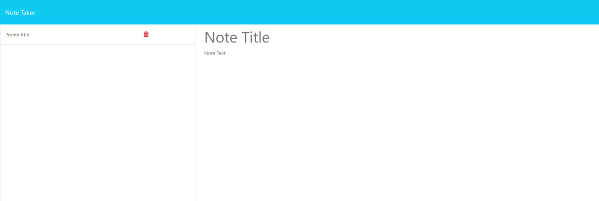

# Notate Application

Notate Application is a simple web-based note-taking tool that allows users to create, save, and manage their notes. This application is built with Express.js for the back end.